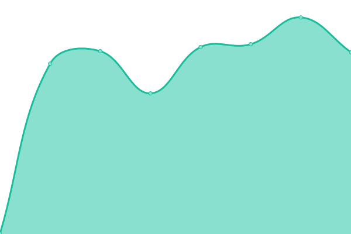
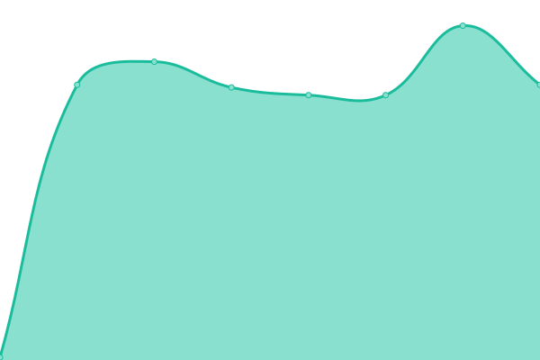

# [📈 Live Status](https://kevinpapst.github.io/cloud-status): <!--live status--> **🟩 All systems operational**

This repository contains the open-source uptime monitor and status page for [Kevin Papst](www.kevinpapst.de), powered by [Upptime](https://github.com/upptime/upptime).

With [Upptime](https://upptime.js.org), you can get your own unlimited and free uptime monitor and status page, powered entirely by a GitHub repository. We use [Issues](https://github.com/kevinpapst/cloud-status/issues) as incident reports, [Actions](https://github.com/kevinpapst/cloud-status/actions) as uptime monitors, and [Pages](https://kevinpapst.github.io/cloud-status) for the status page.

<!--start: status pages-->
<!-- This summary is generated by Upptime (https://github.com/upptime/upptime) -->
<!-- Do not edit this manually, your changes will be overwritten -->
<!-- prettier-ignore -->
| URL | Status | History | Response Time | Uptime |
| --- | ------ | ------- | ------------- | ------ |
|  [Website](https://www.kimai.cloud) | 🟩 Up | [website.yml](https://github.com/kevinpapst/cloud-status/commits/HEAD/history/website.yml) | 

 1015ms
     
 | 

<a href="https://uptime.kimai.cloud/history/website">100.00%</a>
    

|  [Demo Cloud](https://kevin.kimai.cloud/de/login) | 🟩 Up | [demo-cloud.yml](https://github.com/kevinpapst/cloud-status/commits/HEAD/history/demo-cloud.yml) | 

 733ms
     
 | 

<a href="https://uptime.kimai.cloud/history/demo-cloud">99.61%</a>
    

|  Database Cluster | 🟩 Up | [database-cluster.yml](https://github.com/kevinpapst/cloud-status/commits/HEAD/history/database-cluster.yml) | 

 127ms
     
 | 

<a href="https://uptime.kimai.cloud/history/database-cluster">100.00%</a>
    

|  Database Backup | 🟩 Up | [database-backup.yml](https://github.com/kevinpapst/cloud-status/commits/HEAD/history/database-backup.yml) | 

 131ms
     
 | 

<a href="https://uptime.kimai.cloud/history/database-backup">100.00%</a>
    

|  [Demo Cloud (Custom Domain)](https://time.kevinpapst.de/de/login) | 🟩 Up | [demo-cloud-custom-domain.yml](https://github.com/kevinpapst/cloud-status/commits/HEAD/history/demo-cloud-custom-domain.yml) | 

 1381ms
     
 | 

<a href="https://uptime.kimai.cloud/history/demo-cloud-custom-domain">99.61%</a>
    

|  Outbound Emails | 🟩 Up | [outbound-emails.yml](https://github.com/kevinpapst/cloud-status/commits/HEAD/history/outbound-emails.yml) | 

 123ms
     
 | 

<a href="https://uptime.kimai.cloud/history/outbound-emails">100.00%</a>
    

<!--end: status pages-->

[**Visit our status website →**](https://kevinpapst.github.io/cloud-status)

## 📄 License

- Powered by: [Upptime](https://github.com/upptime/upptime)
- Code: [MIT](./LICENSE) © [Kevin Papst](www.kevinpapst.de)
- Data in the `./history` directory: [Open Database License](https://opendatacommons.org/licenses/odbl/1-0/)
